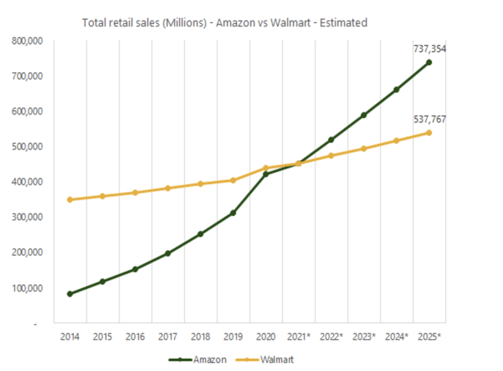

# Amazon's AI-Powered Supply Chain - The Secret to It's Dominance

## Overview and Origin

* **Amazon**

* Founded: July 5, 1994, Bellevue, WA

* Founder: Jeff Bezos

* Amazon was founded by Jeff Bezos from his garage in Bellevue, Washington, on July 5, 1994. Initially an online marketplace for books, it has expanded into a multitude of product categories, a strategy that has earned it the moniker The Everything Store.

* The initial start-up capital for Amazon.com came primarily from Jeff Bezo's parents, and they invested a large fraction of their life savings in what became Amazon.com. Later Amazon raised $8M from Kleiner Perkins Caufield & Byers in 1995. In 1997, Amazon went public to raise additional capital. 
As of today, Dec 2023, Amazon's market capitalization is worh of $1.5 trillion

## Business Activities

* Here, we are tying to study Amazon's AI implemenation and its impact on its supply chain to catch up with current and future customer demand.

* Eventhogh Amazon products' targeted audience are its B2B and B2C customers, the online reatil store is predomemntly enjoyed by general public.
From an anual revenue of approximately $500 billion, half of the revenue are geneted by the online store

* Amazon's AI-powered warehouse and delivery optimization helping the company to tackle the supply chain issues to keep up the customer demand. This gives Amazon an edge to have a healthy compition with its competitors like Walmart in Online Retail market.

Below chart can give an idea of estimated retail sales for Amazon in the past and future comparing with it's competitor Walmart. 

* In Amazon wherehouse, the **Robots** that carry out the orders are **AI-powered**, and algorithms help them learn details like where the order is, where it is supposed to be and how to fulfill it in the fastest way possible. All this happens in real-time.

Expansive spreadsheets remain the first choice for many retailers for running supply chains. However, this practice leads to unstructured and disconnected datasets, resulting in higher operational expenses.

Amazon has learned to leverage AI for redesigning supply and making sense of data, automating the process of predicting customer demand, optimizing delivery routes, and personalizing customer communications — all the while monitoring the whole supply chain.

The **Internet of Things (IoT)** has immensely transformed Supply Chain Management (SCM) by enabling machines to connect and interact with products and customers.

1. **Smart glasses**, for instance, enable warehouse workers to see text and images about a product in the warehouse. You can scan barcodes and use voice commands to confirm the activities on the go and aim at a handheld scanner for automatically entering critical information — thus making your job easier.

2. The **vision picking system documents** product lots on its own, completely removing the need for doing any laborious paperwork.

3. Employing collaborative **bots** (such as Mobile Rack GTP AMR robots) accelerates how a warehouse functions as the bots are faster than an average human being.

4. Simplify tracking your physical inventory at the warehouse with the help of **RFID** tags. Keep an eye on when a product expires to ensure the right items move to the end of the supply chain before they expire.

## Landscape

* Amazon business model are into Online Reatail Stores, Third Party Seller Service, Amazon Webservice, Physical Stores, Subscription Services etc.

* The high online demands is driving companies to come up with various innovative AI and IOT powered tools to fulfill the customer demand. 

* Amazon's major competitors in Online Store areas are Alibaba, Target, eBay, Walmart, JD, Flipkart, and Rakuten

## Results

* The below digram can give the business forecast for Amazon in coming years.

* What are some of the core metrics that companies in this field use to measure success? How is your company performing based on these metrics?

* From the digram, we can get an idea of the level of estimated sales growth Amazon is expecting with its immdediate compitator Walmart.

## Recommendation

* The recomemnation to Amazon as a shareholder is to also increase concentartion to hign margin products. By that way, the revenue can be increased. By leveraging the existint AI powered tools and the new areas of innovation can be a solution to achive that goal.

## References

- Wikipedia
- [Amazon Start-up story](ttps://www.fundable.com/learn/startup-stories/amazon)
- [Amazon Business Revenue Model](https://startuptalky.com/business-revenue-model-amazon/)
- [Approach In How Amazon Uses AI](https://www.zentail.com/blog/amazons-flywheel-approach-how-amazon-uses-ai)
- [Amazon AI Powered Supply Chain](https://www.fool.com/investing/2023/05/10/is-amazons-ai-powered-supply-chain-the-secret-to-i/)

- [CBS Report On Amazon Powered AI for Thanks Giving Order Fulfillment](https://tbtech.co/featured-news/amazons-ai-logistics-warehouses/)
